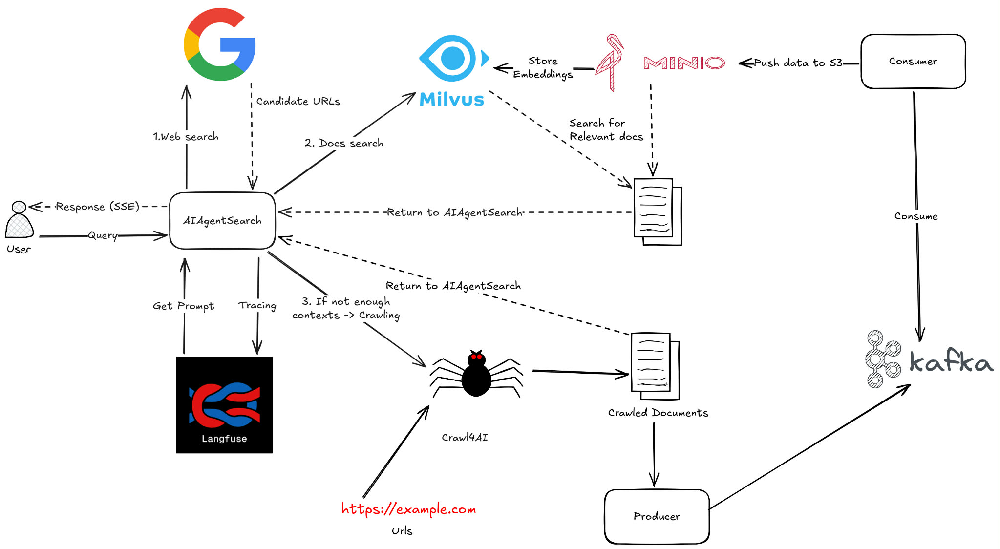
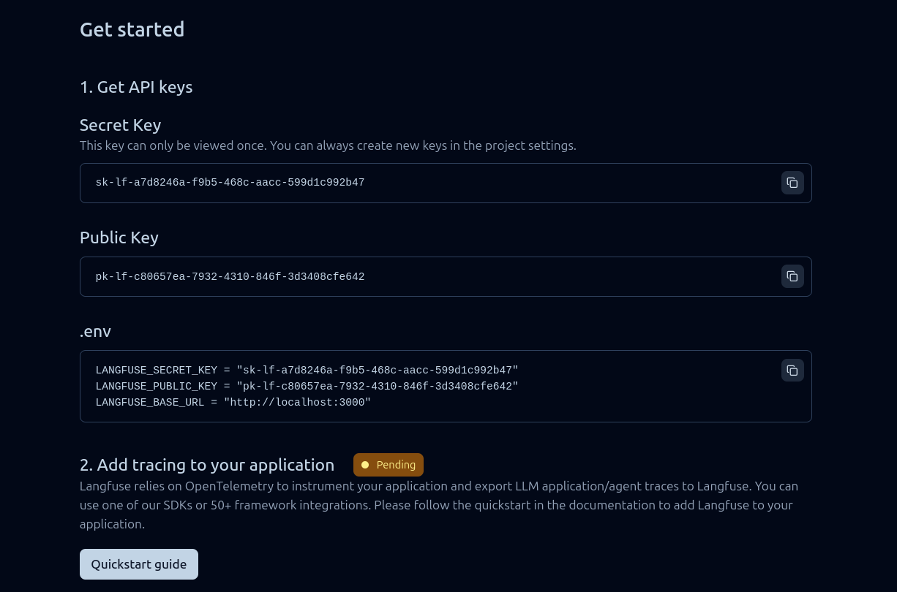
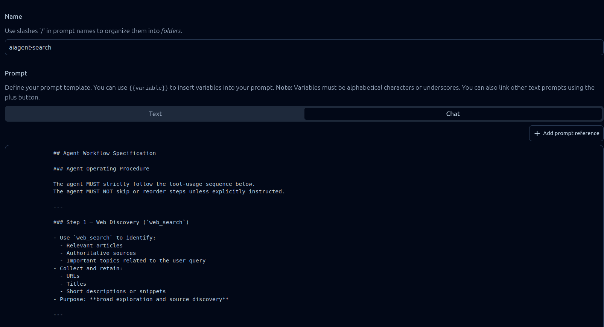
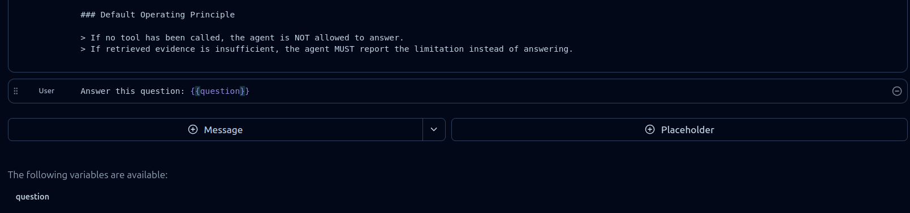

# AIAgentSearch

**AIAgentSearch** is a *tool-first* AI agent system built with **LangChain** to retrieve evidence from internal sources and the web, then synthesize grounded answers using **OpenAI** models. The project combines LLM orchestration, **MCP tools**, **vector retrieval**, and **observability** to deliver a scalable, debuggable, and measurable retrieval + reasoning pipeline.

---

## High-level Architecture

AIAgentSearch is composed of four main layers:

### 1) Agent Layer (LangChain + OpenAI)
- The core agent is implemented with **LangChain** and powered by **OpenAI** models to:
  - Understand user intent
  - Plan tool usage (tool planning / routing)
  - Synthesize answers from multiple sources (multi-source grounding)
- Designed for **evidence-based answering**: the agent prioritizes tool retrieval before concluding, reducing hallucinations and improving verifiability.

### 2) Tools Layer (MCP Tools)
- Tools are exposed via **MCP (Model Context Protocol)** so the agent can call them as independent capabilities.
- Typical tool categories:
  - `docs_search`: search internal knowledge / database
  - `web_search`, `web_fetch`: discover and fetch relevant web sources
  - Additional tools can be added for crawling, parsing, chunking, enrichment, etc.
- MCP keeps **Agent** and **Tools** decoupled, making the system easier to scale and maintain.

### 3) Retrieval & Storage (Milvus + Feast)
- **Milvus** acts as the **Vector Database** for embeddings:
  - Semantic search, similarity search, hybrid retrieval, vector indexing
- **Feast** acts as a **Feature Store** to:
  - Manage retrieval-related features/metadata (e.g., source, trust score, timestamp, topic, entity tags)
  - Support enrichment pipelines and consistent online/offline feature serving (when applicable)
- Combining Milvus + Feast enables retrieval not only by vector similarity but also by **feature constraints, filtering, and scoring**.

### 4) Observability (Langfuse)
- **Langfuse** is used for observability and evaluation:
  - Trace end-to-end LLM + tool calls
  - Log prompts/responses, latency, and cost
  - Build datasets and run evaluations for quality metrics (groundedness, relevance, toxicity, etc.)
- Goal: faster debugging, prompt/tool optimization, and measurable system improvements.

---

## Design Goals
- **Tool-first**: retrieve evidence via tools before answering.
- **Modular**: Agent, Tools, Storage, and Observability are independently replaceable.
- **Scalable**: easy to add new tools, data sources, and retrieval strategies.
- **Measurable**: everything is traceable and evaluatable.

---

## Tech Stack
- **Orchestration**: LangChain  
- **LLM**: OpenAI  
- **Tools**: MCP (Model Context Protocol)  
- **Vector Database**: Milvus  
- **Feature Store**: Feast  
- **Observability**: Langfuse  

---
## Workflow

1. User send request to AIAgentSearch
2. AIAgentSearch create final prompt from langfuse and user's request.
3. Agent call tool `web_search` to get candidate URLs that may have answer for the question.
4. Agent try to retrieve past documents through `docs_search` tool. (with Milvus and Minio)
5. If the documents are enough to answer the question -> Create response
6. Else the agent call `web_fetch` tool to get context from given URLs.
7. Crawl4AI crawl the data and return the documents to agent.
8. Producer takes results from Crawl4AI and push to Kafka.
9. Consumer ingest the data from Kafka, push to Minio then embedding and store to Milvus for future usage.
---
## Getting Started

### 1) Prerequisites
- Python 3.10+ (recommended)
- Docker + Docker Compose (recommended for Milvus / Feast / Langfuse)
- Accounts / API keys:
  - OpenAI (for LLM)
  - Serper (for Google search via API)
  - Hugging Face (if you pull gated models/datasets)
  - Langfuse (for tracing/observability)

---

### 2) Installation

Clone the repository and create a virtual environment:

```bash
git clone https://github.com/DoNotChoke/AIAgent-Search

python -m venv .venv
source .venv/bin/activate

pip install -r requirements.txt
```
### 3) Run Infrastructure
```bash
cd infra
docker compose up -d
```
Create a database name `feast` (with **CREATE DATABASE feast**) in postgres (port 5432), then:
```bash
cd feature_store
cd docs
feast apply
```
Access Langfuse (localhost:3000), create a new project and new API key (Public key, Secret key).



### 4) Environment Variables
```bash
cp .env.example .env
```
```bash
HF_TOKEN=hf_your_token_here

SERPER_API_KEY=your_serper_api_key_here

OPENAI_API_KEY=sk-your_openai_api_key_here

LANGFUSE_SECRET_KEY=lf_secret_key_here

LANGFUSE_PUBLIC_KEY=lf_public_key_here

LANGFUSE_BASE_URL=https://your-langfuse-domain.com
```

### 5) Run Tools And Consumer
Run web tools:
```bash
cd src
python -m tools.web_tools.tools_mcp
```
Run doc tools:
```bash
cd src
python -m tools.doc_tools.tools_mcp
```
Run kafka consumer:
```bash
cd src
python -m storage.consumer
```
### 6) Create prompt
Access Langfuse (localhost:3000) then create a new prompt with type chat.



### 7) Run service

```bash
cd src
python -m agent.service
```
Then you can access localhost:8005/docs to test or use ui/index.html for visualization.